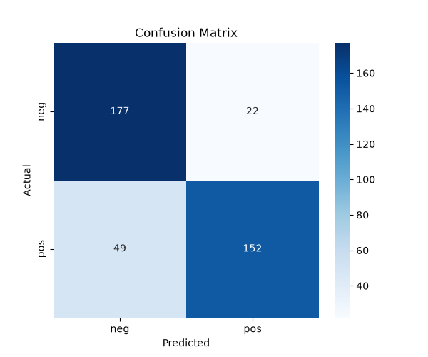

# movie-sentiment-classifier

Movie Sentiment Classifier and description 
The project predicts positive/negative sentiment from movie review text. 

Dataset
The project uses NLTK movie reviews corpus and 2,000 labeled reviews that is balanced 1000/1000 for positive and negative reviews
Tech stack
nltk
pandas
scikit-learn
matplotlib
seaborn

Project structure
```
movie-sentiment-classifier/
├── src/
│   ├── 01_explore.py
│   ├── 02_preprocess.py
│   ├── 03_train.py
│   └── 04_predict.py
├── data/
│   ├── reviews_raw.csv
│   ├── data.pkl
│   └── trained_data.pkl
├── outputs/
│   ├── review_length_distribution.png
│   └── confusion_matrix.png
├── .venv/
├── .gitignore
├── README.md
```
Setup instructions 
## Setup

1. Clone the repository and navigate into the project folder

2. Create a virtual environment:
```
python -m venv .venv
```

3. Activate it (Windows PowerShell):
```
& .venv\Scripts\Activate.ps1
```

4. Install dependencies:
```
pip install nltk pandas scikit-learn matplotlib seaborn
```

5. Download the NLTK movie reviews dataset:
```
python -c "import nltk; nltk.download('movie_reviews')"
```

Results
Four methods were used to evaluate the model, namely accuracy, precision and recall, the results are 82.25%, ~83% and  ~82%, respectively. 

A confusion matrix was also used to evaluate the model. 177/152 correct, some negative reviews slightly better classified than positive.

Some top predictive words:
Top negative words:
seagal -1.24
worst -1.19
stupid -1.17

Top positive words:
jedi 0.96
outstanding 0.96
guido 0.97
damon 0.97



Potential next steps 
could try Logistic Regression for comparison.
could add bigrams to catch phrases like 'not good'.
add a neutral column